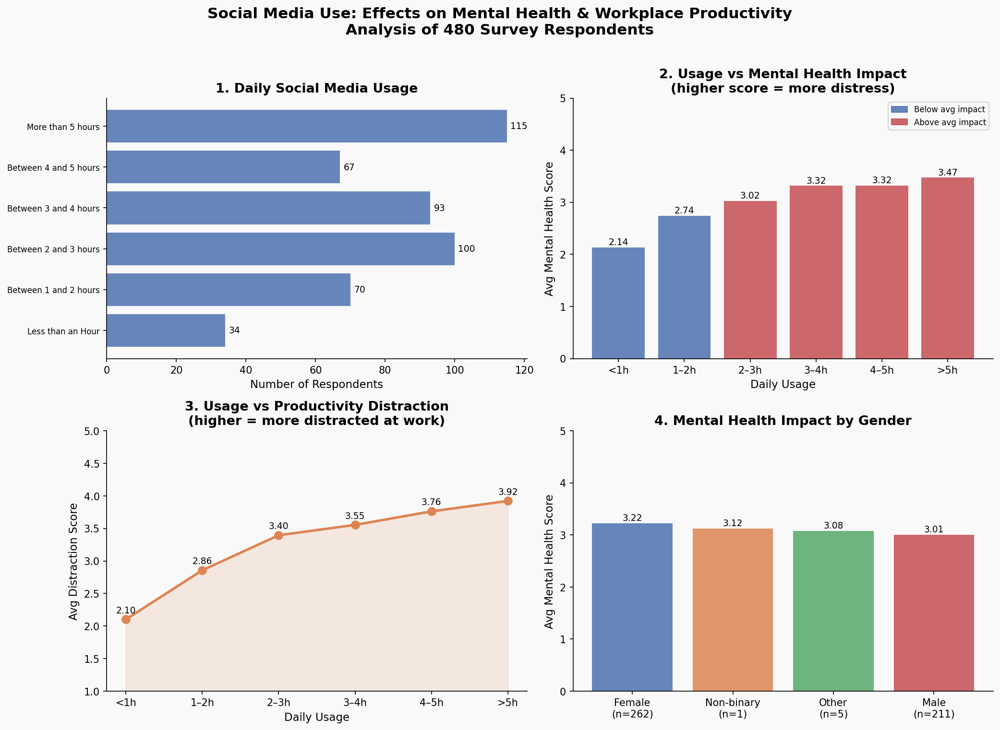

# Social Media & Mental Health at Work
### A Python Data Analysis Project

---

## Why I Built This

I'm a psychology graduate with a growing interest in how our digital habits affect the way we think, feel, and work. Social media is something almost everyone uses daily but how much does it actually cost us in terms of focus, wellbeing, and mental health?
This project started as a personal curiosity and turned into a proper data analysis. I wanted to go beyond the "social media is bad for you" headlines and actually look at what the numbers say, broken down by usage patterns, gender, and workplace productivity.

---

## The Dataset

I used the **Social Media and Mental Health** dataset from Kaggle, which contains survey responses from **479 participants** across different age groups, genders, and occupations.

Each respondent answered questions about:
- How much time they spend on social media daily
- How distracted they get while working
- Their mental health indicators (sleep, depression, anxiety, self-comparison, validation-seeking)
- Their general wellbeing and concentration levels

> Dataset source: [Kaggle — Social Media and Mental Health](https://www.kaggle.com/datasets/souvikahmed071/social-media-and-mental-health)

---

## My Findings

Here are the four key takeaways from the analysis:

### 1. Most people are using social media a lot
The most common response was **"more than 5 hours per day"** — 115 out of 479 respondents fell into this category. That's nearly 1 in 4 people spending over a quarter of their waking hours on social media.

### 2. Heavy users show significantly worse mental health scores
Users who spend **more than 5 hours** on social media daily had an average mental health distress score of **3.47 out of 5**, compared to just **2.14** for those using it less than an hour a day. That's a meaningful difference not just a statistical blip.

### 3. Productivity takes a hit too
The more time someone spends on social media, the more distracted they get during work or study. Distraction scores rose steadily from **2.10** (light users) all the way to **3.92** (heavy users) which is nearly double.

### 4. There's a moderate correlation between usage and mental health
The correlation between daily social media usage and mental health distress was **r = 0.387** a moderate positive relationship. This means that while social media use isn't the only factor affecting mental health, there's a consistent pattern worth paying attention to.

---

## Data Visualisation

The analysis produces a 4-panel chart covering:
- Distribution of daily social media usage
- Average mental health score by usage group
- Productivity distraction levels by usage group
- Mental health impact broken down by gender



---

## Tools Used

| Tool | Purpose |
|------|---------|
| Python 3 | Core programming language |
| Pandas | Data loading, cleaning, and analysis |
| Matplotlib | Charts and visualisations |
| Seaborn | Styling and colour palettes |

---

## How to Run This Yourself

1. Clone or download this repository
2. Make sure you have Python 3 installed
3. Install the required libraries:
```bash
pip3 install pandas matplotlib seaborn
```
4. Place the `smmh.csv` file in the same folder as `analysis.py`
5. Update the file path in line 22 of `analysis.py` to match your system
6. Run the script:
```bash
python3 analysis.py
```
The chart will be saved as `social_media_analysis.png` in the same folder.

---

## My Thoughts

What struck me most wasn't any single finding, it was the consistency of the pattern. Across every metric, from sleep issues to difficulty concentrating to feelings of depression, heavier social media use was associated with worse outcomes. It's not a dramatic effect, but it's a steady one.

As someone studying the intersection of psychology and data, this project reinforced something I believe strongly: data doesn't replace human understanding, it deepens it. The numbers here aren't just statistics — they represent real people's daily experiences, and that's worth taking seriously.

---

## About Me

I'm Nidhika, a final-year Applied Psychology student at Amity University, Noida. I'm passionate about people analytics, workplace wellbeing, and using data to understand human behaviour better. This is one of my first independent data projects, feedback is always welcome!

---

*Built with curiosity, Python, and a lot of trial and errors*
